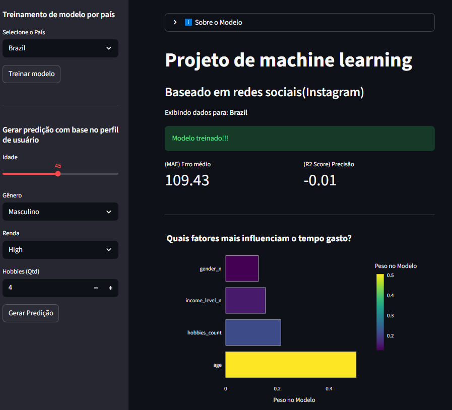

# 📱 Social Media Engagement Predictor
Este projeto utiliza Machine Learning para analisar e prever o comportamento de usuários no Instagram. Ele resolve dois problemas principais:

## Regressão: Prever quantos minutos um usuário passará na plataforma com base em seu perfil.

## Classificação: Identificar qual tipo de conteúdo (Reels, Stories ou Fotos) o usuário prefere.

## Funcionalidades
- Dashboard Interativo: Filtros por país para análise regional.

- Gráficos Dinâmicos: Visualização de quais variáveis (idade, renda, hobbies) mais impactam o algoritmo.

- Simulador em Tempo Real: Insira dados de um perfil e receba uma predição instantânea.

# Tecnologias Utilizadas
- Python
- Streamlit: Interface do usuário.
- Pandas: Manipulação e limpeza de dados.
- Scikit-Learn: Algoritmos de Random Forest (Regressor e Classifier).
- Plotly: Gráficos interativos.

# Resultados do Modelo
- O modelo atual apresenta:
- **R² Score**: 0.84 (Explicando 84% da variação dos dados).
- **MAE**: 43 minutos (Erro médio por predição).

# Como Funciona o Algoritmo?
O projeto utiliza o algoritmo Random Forest (Floresta Aleatória), que opera criando múltiplas "árvores de decisão" durante o treinamento:

Na **Regressão**: O modelo combina as previsões de centenas de árvores para calcular a média de minutos que um usuário passará online.

Na **Classificação**: O algoritmo realiza uma "votação" entre as árvores para decidir qual categoria de conteúdo (Reels, Fotos ou Stories) melhor se encaixa no perfil inserido.

A principal vantagem deste modelo é a sua robustez contra outliers e a capacidade de medir a Importância das Variáveis, permitindo-nos saber exatamente que a "Idade", por exemplo, é um fator mais determinante que a "Renda" para o tempo de uso.

# Como rodar o projeto
- Clone o repositório:'''bash git clone https://github.com/seu-usuario/seu-repositorio.git'''

- Instale as dependências:'''bash pip install -r requirements.txt'''

- Execute o App:'''bash streamlit run main.py'''

# Fonte de dados
Dados baseados no dataset Social Media User Analysis disponível no Kaggle